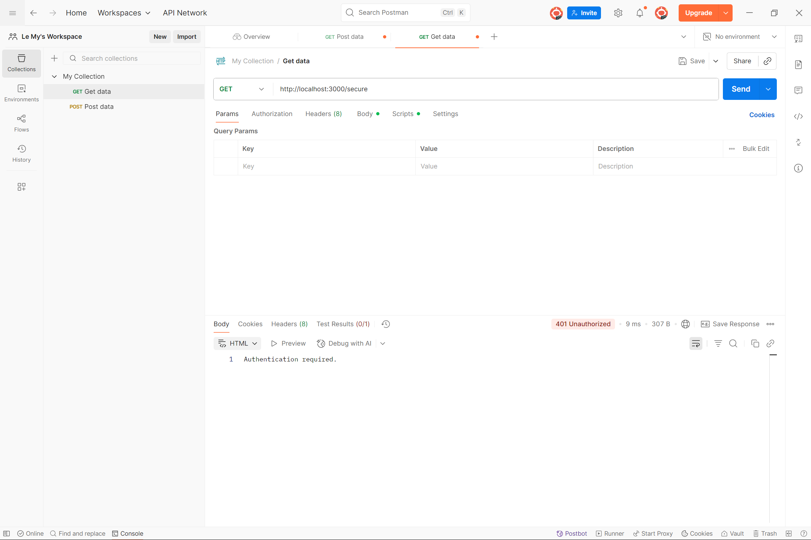

# Hướng dẫn chạy và kiểm thử Basic Authentication

## Giới thiệu

Repo này minh họa 2 phương pháp xác thực phổ biến trong Node.js:

- `Basic Authentication (basic_auth.js)`: Client gửi thông tin đăng nhập trực tiếp trong header Authorization.
- `Cookie-based Authentication (cookie_auth.js)`: Client gửi thông tin đăng nhập qua API /login, server tạo cookie lưu trạng thái đăng nhập, và client sẽ gửi cookie trong các request sau.

## Cài đặt & chạy ứng dụng

Clone repo về máy:
```bash
git clone <https://github.com/LeHoangMy063/simple_auth>`
cd simple_auth`
```

Cài dependencies:
    
    npm install
---
# 1a. Basic Authentication (basic_auth.js)

Chạy server: `node basic_auth.js`
    
Server chạy tại http://localhost:3000 

1. Tạo một request mới.

2. Ở phần Method, chọn GET.

Nhập URL: `http://localhost:3000`

3. Chuyển sang tab Authorization.

Trong Auth Type, chọn Basic Auth.

- Username: admin

- Password: 12345

Nhấn nút Send để gửi request.

Ảnh test:



