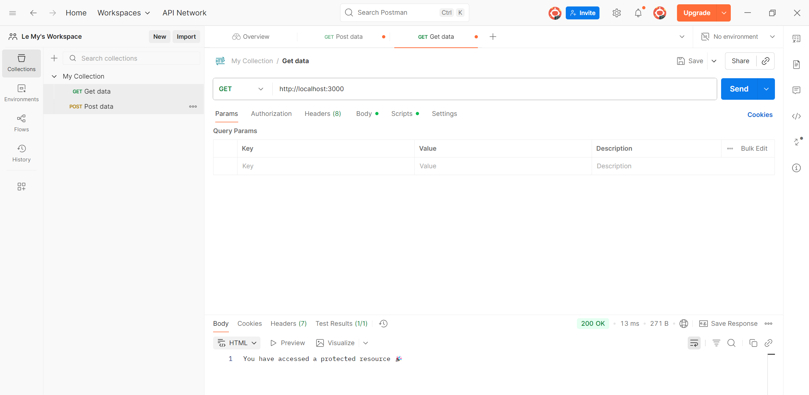
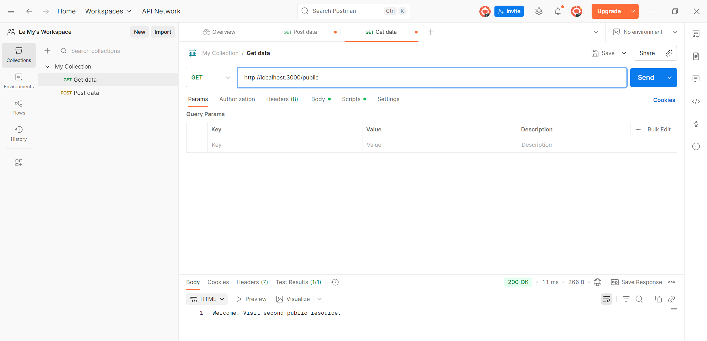
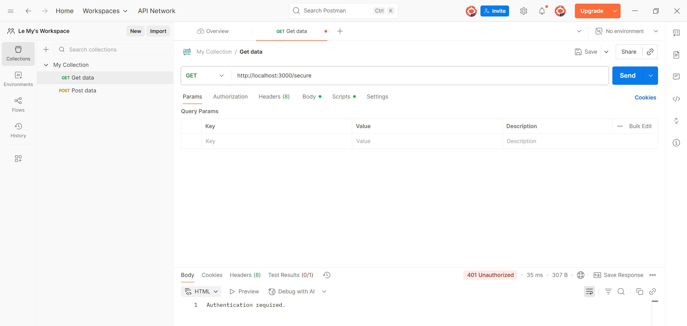
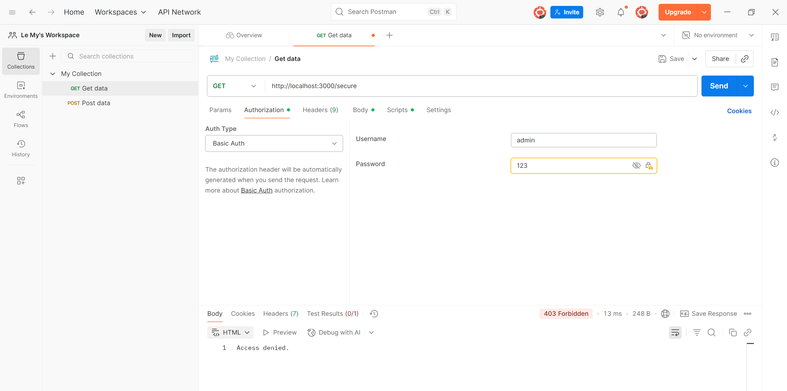
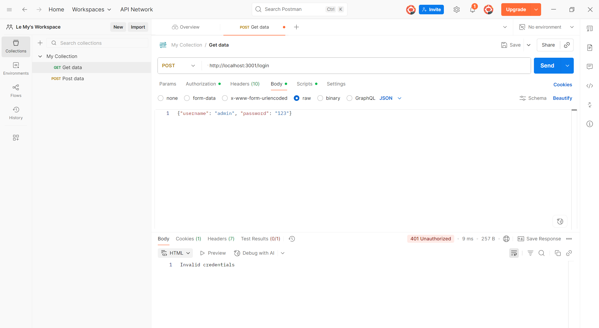
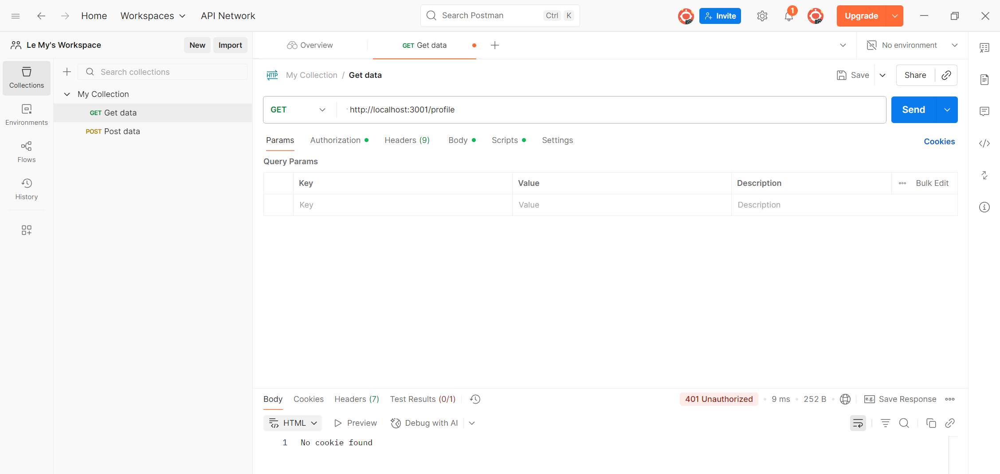
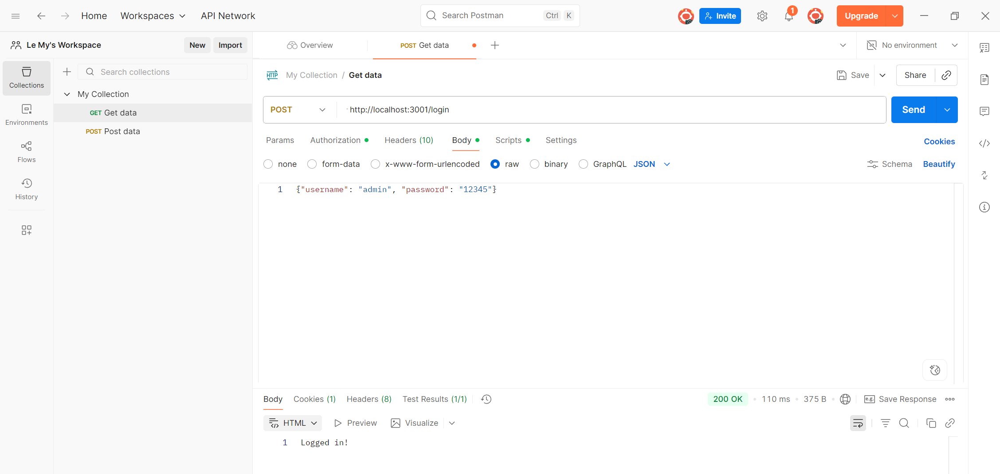
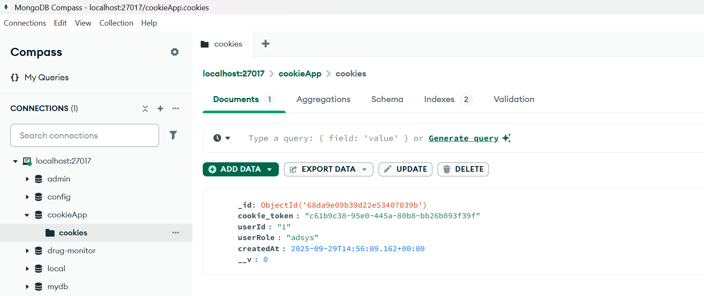

# Hướng dẫn chạy và kiểm thử Basic Authentication

## Giới thiệu

Repo này minh họa 2 phương pháp xác thực phổ biến trong Node.js:

- `Basic Authentication (basic_auth.js)`: Client gửi thông tin đăng nhập trực tiếp trong header Authorization.
- `Cookie-based Authentication (cookie_auth.js)`: Client gửi thông tin đăng nhập qua API /login, server tạo cookie lưu trạng thái đăng nhập, và client sẽ gửi cookie trong các request sau.

## Cài đặt & chạy ứng dụng

Clone repo về máy:
```bash
git clone <https://github.com/LeHoangMy063/simple_auth>`
cd simple_auth`
```

Cài dependencies:
    
    npm install
---
# 1a. Basic Authentication (basic_auth.js)

## Demo Account
Username: admin

Password: 12345

Chạy server: `node basic_auth.js`
    
Server chạy tại http://localhost:3000 

1. Tạo một request mới.

2. Ở phần Method, chọn GET.

Nhập URL: `http://localhost:3000` -> Send


Ảnh test:


- GET: `http://localhost:3000/public` -> Send

Ảnh test:



- GET: `http://localhost:3000/secure` [without Header] -> Send


Ảnh test:



Chuyển sang tab Authorization.

Trong Auth Type, chọn Basic Auth.

    Username: admin

    Password: 12345

- GET: `http://localhost:3000/secure` [Header] -> Send


- GET: `http://localhost:3000/secure` [WrongPass] -> Send


# 2.Cookie Authentication (cookie_auth.js)

## Demo Account

Username: admin

Password: 12345

Chạy server: `node cookie_auth.js`
    
Server chạy tại http://localhost:3001

a. Login

1. Tạo một request mới.

2. Ở phần Method, chọn POST.

- POST: `http://localhost:3001/login` 

- Body (JSON): { "username": "admin", "password": "123" } -> Send

Ảnh test:



- GET: ` http://localhost:3001/profile`
Ảnh test:



- POST: `http://localhost:3001/login` 

- Body (JSON): { "username": "admin", "password": "12345" } -> Send

Ảnh test:



- GET: ` http://localhost:3001/profile`
Ảnh test:


---
## Cookie in MongoDB
Sau khi đăng nhập, mở MongoDB:



